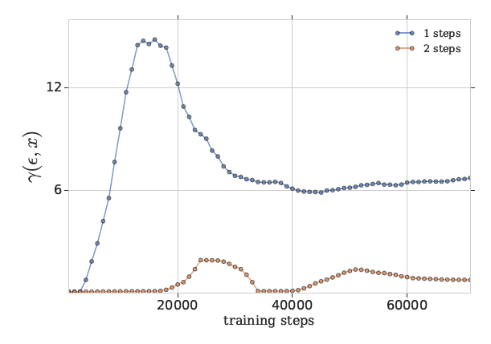

## 5.16

### 探究 Margin Loss 对 single-step Adversarial Training 的影响

注意：这里都用 ==Fast AT==

- [ ] 对比实验：(**cyclic** learning rate)

|         | Exp1[ ] |   Exp2[ ]   |   Exp3[ ]   |   Exp4[ ]   |
| :-----: | :-----: | :---------: | :---------: | :---------: |
| Attack  |   Lce   | Margin Loss |     Lce     | Margin Loss |
| Defense |   Lce   |     Lce     | Margin Loss | Margin Loss |

目的： 探寻 Margin Loss 是在 Attack 上更有效果，还是在 Defense 上，还是 两者一起的时候最有效。

- [ ] $l_2$ distance 度量

|                    |                  $l_2$                  |                 $l_2$                  |
| :----------------: | :-------------------------------------: | :------------------------------------: |
|    PGD Training    | $\Vert f(x_{marg}),f(x_{fgsm}) \Vert_2$ | $\Vert f(x_{marg}),f(x_{pgd}) \Vert_2$ |
| Fast FGSM Training | $\Vert f(x_{marg}),f(x_{fgsm}) \Vert_2$ | $\Vert f(x_{marg}),f(x_{pgd}) \Vert_2$ |

目的：观察现象，看看 $x_{marg}$ 的强度 和 $x_{fgsm}$ 更近，还是脱离了这个程度，即 behave like $x_{pgd}$

### 探究 LLR 对 single-step Adversarial Training 的影响

- [ ] 对比实验：(**cyclic** learning rate)

|         | Exp1[ ] | Exp2[ ] | Exp3[ ] | Exp4[ ] |
| :-----: | :-----: | :-----: | :-----: | :-----: |
| Attack  |   Lce   |   LLR   |   Lce   |   LLR   |
| Defense |   Lce   |   Lce   |   LLR   |   LLR   |
