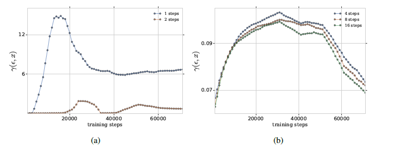

## 论文笔记：

### Robust Single-step Adversarial Training with Regularizer

> 疑惑：
>
> 1. Free AT is robust against PGD attack that can **break FGSM AT**.
> 2. 方法和RST一模一样....无语到

### Adversarial Robustness through Local Linearization

#### Motivation

> We can simply reduce the cost against generating adversarial samples by reducing the steps of PGD. So it's intuitive to figure out how adversarial training behaves as the changes of PGD steps.

Suppose $\delta \in B(\epsilon)$ and the loss funcion $\ell(x^\prime)(\,\,x^\prime = x + \delta)$ is differentiable. The first-order Taylor expansion for a given $x^\prime = x$ is:
$$
    \ell(x^\prime) \approx \ell(x) + (x^\prime - x)^T \nabla_x \ell(x) + o(x^\prime -x )
$$

Then, the absolute difference between two values is:
$$
    g(\delta;x) = |\ell(x+ \delta) - \ell(x)-\delta^T\nabla_x\ell(x)|
$$ 

Consequently, we consider the quantity:
$$
    \gamma(\epsilon, x) = \max \limits_{\delta \in B(\epsilon)} g(\delta; x)
$$

And the observations:

> 结论：
> 1. 在后续 adversarial training 中，PGD steps 不那么敏感，即 $\ell(x+\delta) \approx \ell(x) + \delta^T\nabla_x\ell(x)$, steps 除了 1-steps 其他的都近似相等，1-steps对应着 **FGSM** ,这也是 FGSM training 后面会 与 PGD training 的robust acc偏差很大的一个角度的解释。
> 2. 我们观察到 FGSM training 的过程中会与 PGD training 的 $\gamma(\delta,x)$ 发生偏离，behave 不一样，那么直观的想法就是让他们表现的**都一样**，约束这个 $\gamma(\delta,x)$ 值不让他变大。